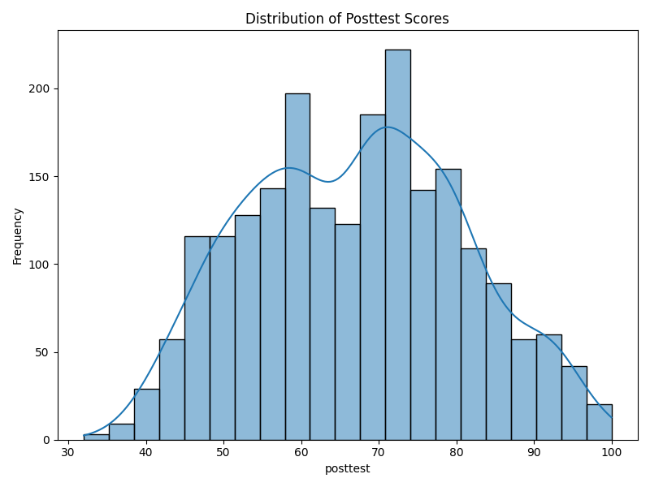
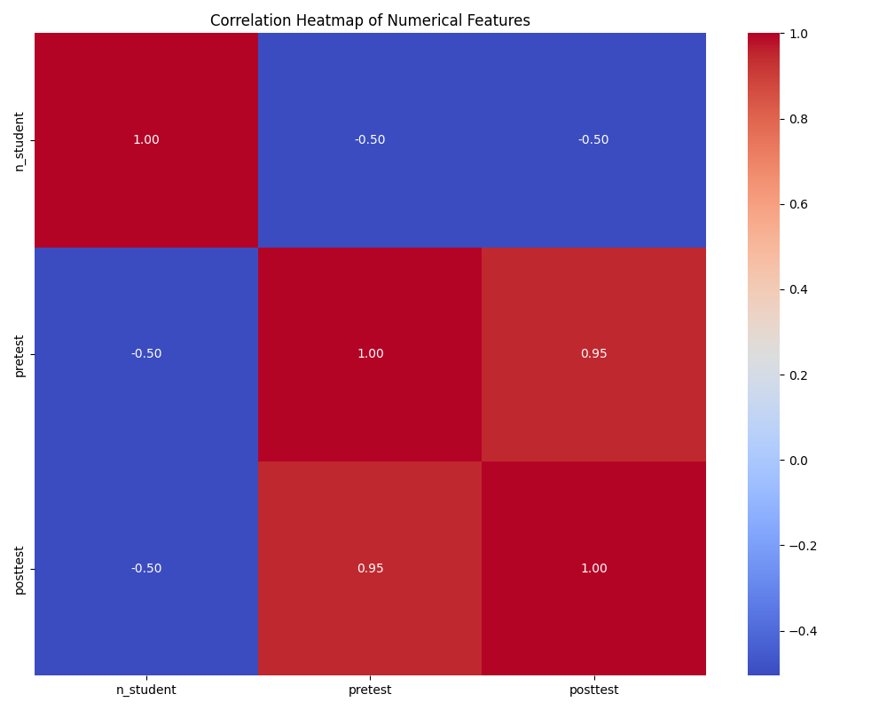
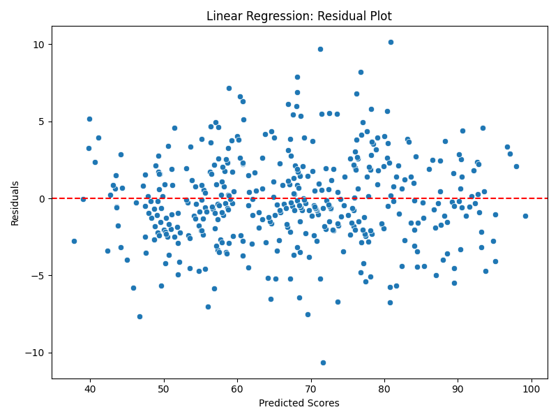

# Reporte de Proyecto: Predicción de Rendimiento Estudiantil

**Título: Predicción de Rendimiento Estudiantil mediante Modelos de Machine Learning**

## Abstract (Resumen)
En este proyecto se desarrolló un modelo de aprendizaje automático para predecir las calificaciones de estudiantes ("posttest") basándose en variables demográficas y escolares. Utilizando un dataset de 2133 registros, se implementaron y compararon tres modelos: Regresión Lineal, Random Forest y Gradient Boosting. Los resultados mostraron que la Regresión Lineal obtuvo el mejor desempeño con un $R^2$ de 0.96 y un Error Estándar Residual (RSE) de 3.55. El análisis exploratorio reveló una fuerte correlación lineal entre el examen previo y el posterior, justificando la eficacia del modelo lineal.

## Objetivo
El objetivo principal es construir un modelo predictivo robusto que estime el puntaje final de un estudiante. Específicamente, buscamos:
1.  Identificar las variables más influyentes en el rendimiento.
2.  Seleccionar el algoritmo que minimice el error de generalización.
3.  Validar los supuestos del modelo mediante análisis de residuos.

## Marco Teórico
Para este problema de regresión, consideramos los siguientes enfoques:

### Regresión Lineal
Modela la relación entre la variable dependiente $Y$ y las variables independientes $X$ como una combinación lineal:
$$Y = \beta_0 + \beta_1 X_1 + \beta_2 X_2 + ... + \beta_n X_n + \epsilon$$
Donde $\epsilon$ es el término de error. Este modelo asume linealidad, independencia y homocedasticidad de los errores.

### Métricas de Evaluación
Para evaluar la calidad del ajuste, utilizamos el Coeficiente de Determinación ($R^2$) y el Error Estándar Residual (RSE), definido como:
$$RSE = \sqrt{\frac{RSS}{n - p - 1}}$$
Donde $RSS$ es la suma de los cuadrados de los residuos, $n$ es el número de observaciones y $p$ es el número de predictores. El RSE penaliza la complejidad del modelo, lo cual es crucial para evitar el sobreajuste.

## Metodología
Nuestra metodología siguió un flujo de trabajo estándar de ciencia de datos:

1.  **Análisis Exploratorio de Datos (EDA)**: Antes de modelar, inspeccionamos la distribución de la variable objetivo y las correlaciones entre variables numéricas.
2.  **Preprocesamiento**:
    *   Eliminación de la columna `student_id`.
    *   Codificación One-Hot para variables categóricas (e.g., `school_setting`).
    *   Escalado estándar para variables numéricas.
3.  **Modelado**: Entrenamos tres algoritmos distintos para capturar tanto relaciones lineales como no lineales.
4.  **Validación**: Utilizamos una división 80/20 para entrenamiento y prueba, evaluando con métricas de error y gráficos de residuos.

## Materiales
El proyecto se desarrolló utilizando el siguiente stack tecnológico:
*   **Python 3.14**: Lenguaje base.
*   **Pandas**: Para la manipulación de estructuras de datos.
*   **Scikit-learn**: Para la implementación de algoritmos de ML y preprocesamiento.
*   **Seaborn/Matplotlib**: Para la generación de visualizaciones estadísticas.

## Desarrollo
El análisis comenzó con la visualización de los datos.

**Distribución de Calificaciones**
El histograma de la variable `posttest` muestra una distribución aproximadamente normal, lo cual es ideal para modelos lineales.


**Correlación de Variables**
El mapa de calor revela una correlación extremadamente alta (0.95) entre `pretest` y `posttest`, sugiriendo que el desempeño previo es el mejor predictor del futuro.


**Implementación del Modelo**
Utilizamos `Pipeline` de Scikit-learn para asegurar que el preprocesamiento se aplique correctamente en validación cruzada.

```python
# Definición del Pipeline de Regresión Lineal
preprocessor = ColumnTransformer(
    transformers=[
        ('num', StandardScaler(), numerical_cols),
        ('cat', OneHotEncoder(handle_unknown='ignore'), categorical_cols)
    ])

pipeline = Pipeline(steps=[('preprocessor', preprocessor),
                           ('regressor', LinearRegression())])

pipeline.fit(X_train, y_train)
```

## Resultados
La comparación de modelos arrojó los siguientes resultados:

| Modelo | MSE | $R^2$ | RSE |
| :--- | :--- | :--- | :--- |
| **Regresión Lineal** | **8.63** | **0.96** | **3.55** |
| Gradient Boosting | 10.01 | 0.95 | 3.82 |
| Random Forest | 11.15 | 0.94 | 4.03 |

La **Regresión Lineal** no solo tuvo el menor error cuadrático medio (MSE), sino también el menor RSE, indicando un mejor ajuste considerando la complejidad del modelo.

**Análisis de Residuos**
Al graficar los residuos de la Regresión Lineal, observamos una dispersión aleatoria alrededor de cero, sin patrones claros en forma de "U" o cono. Esto valida que el modelo lineal es apropiado y que no hay relaciones no lineales significativas que estemos ignorando.



## Conclusiones
El análisis confirma que el rendimiento académico es altamente predecible basándose en el historial previo del estudiante. La simplicidad de la Regresión Lineal resultó ser superior a métodos más complejos como Random Forest, lo que demuestra el principio de parsimonia: el modelo más simple que explica los datos suele ser el mejor. El error promedio de predicción es de aproximadamente 3.55 puntos, lo cual proporciona una herramienta confiable para la estimación de calificaciones.

## Referencias Bibliográficas
1.  Pedregosa, F., et al. (2011). Scikit-learn: Machine Learning in Python. *Journal of Machine Learning Research*, 12, 2825-2830.
2.  James, G., Witten, D., Hastie, T., & Tibshirani, R. (2013). *An Introduction to Statistical Learning*. New York: Springer.
