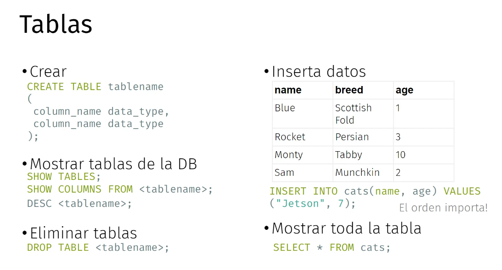
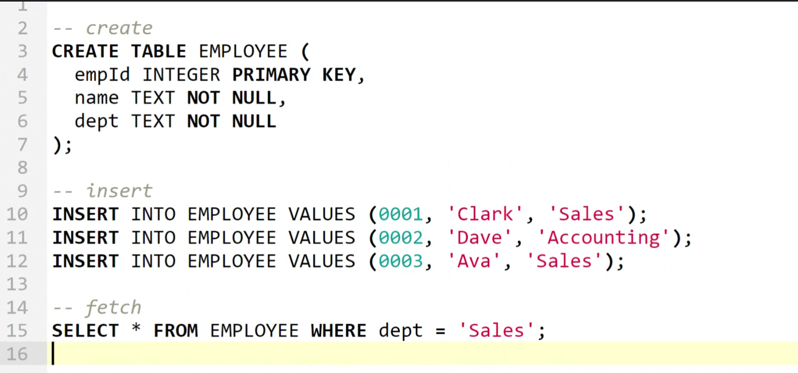
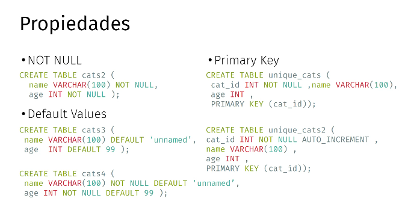

# Bases de Datos

## Qué es una base de datos?

Es una representación abstracta de datos para su facilidad de busqueda, son conjuntos de datos con mecanismos para acceder a ellos de manera sencilla.

### Database vs Database Management System

La diferencia impera en que la base de datos es el conjunto de datos vs que el manejador de base de datos es la herramienta con la cual interactuamos y manipulamos estos conjuntos de datos.

DB en uso:

´´´bash
USE <database name>
´´´
## Tablas 

Las tablas almacenan informacion dentro de una DB relacional
Una coleccion de datos relacionados mantenidos en un formato estructurado dentro de una base de datos.

- ¿Cómo creamos tablas?

- ¿Cómo creamos queries?

## Diagramas entidad - relación

Sirven para realizar una descripcion abstracta para poder representar data como un conjunto de datos que se relacionan entre si.

## Tipos de datos

Tenemos datos de tipo NUMÉRICOS, DATE, STRING, VARCHAR

## Propiedades 

- NOT NULL: vlaidar que la columna forzosamente tiene que tener datos
- Default Values: Si no le se asigna un valor, se pondrá un valor por default
- Primary Key: 

## Tarea 

Define una tabla de empleados con las siguientes